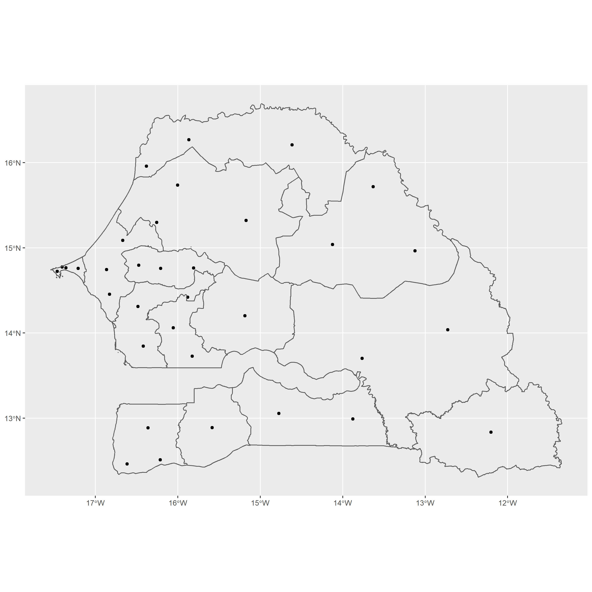
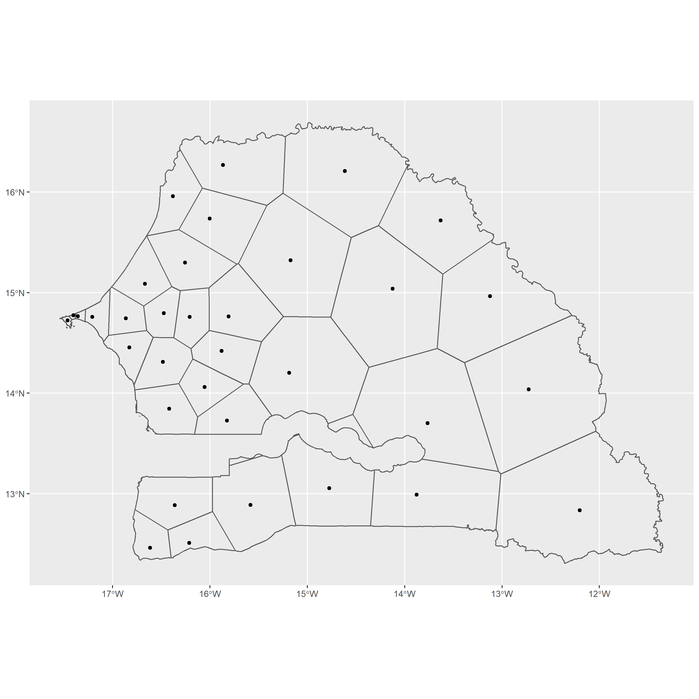
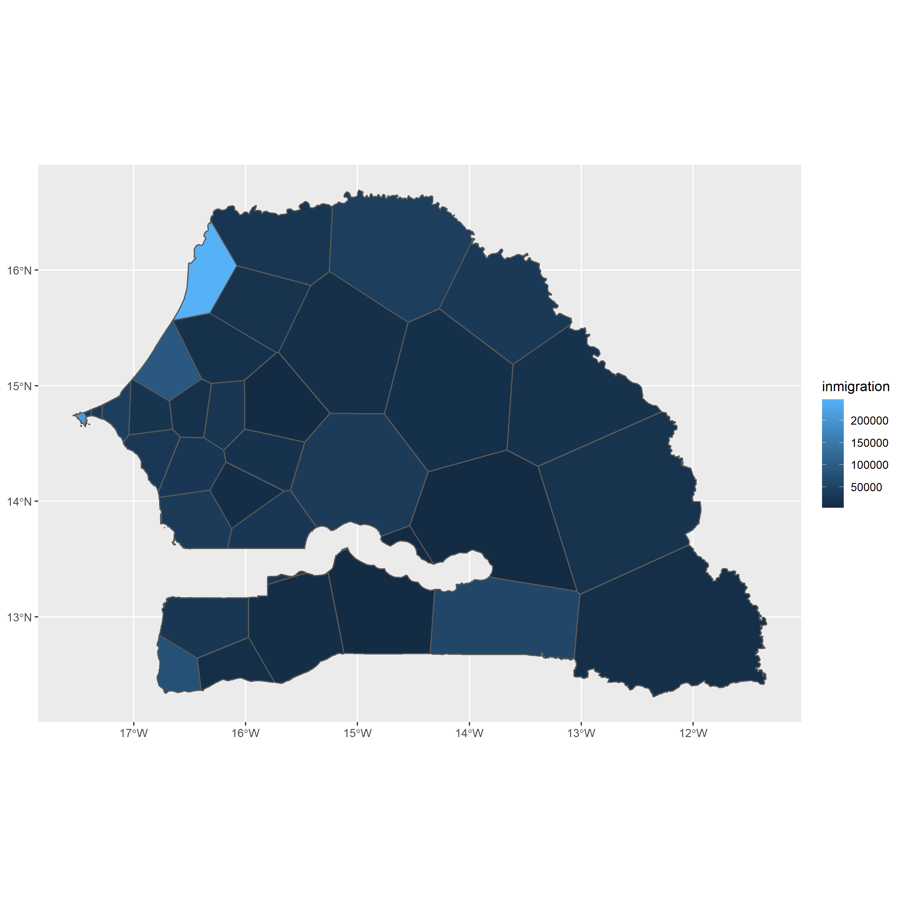
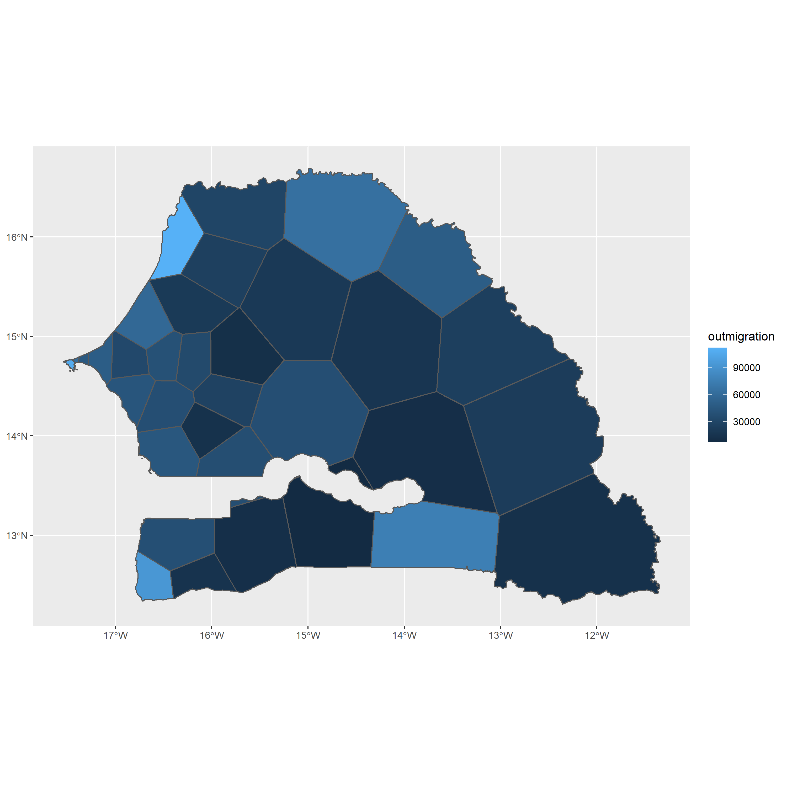
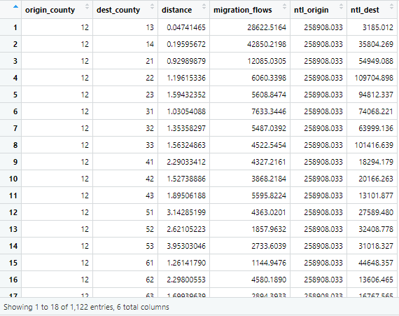
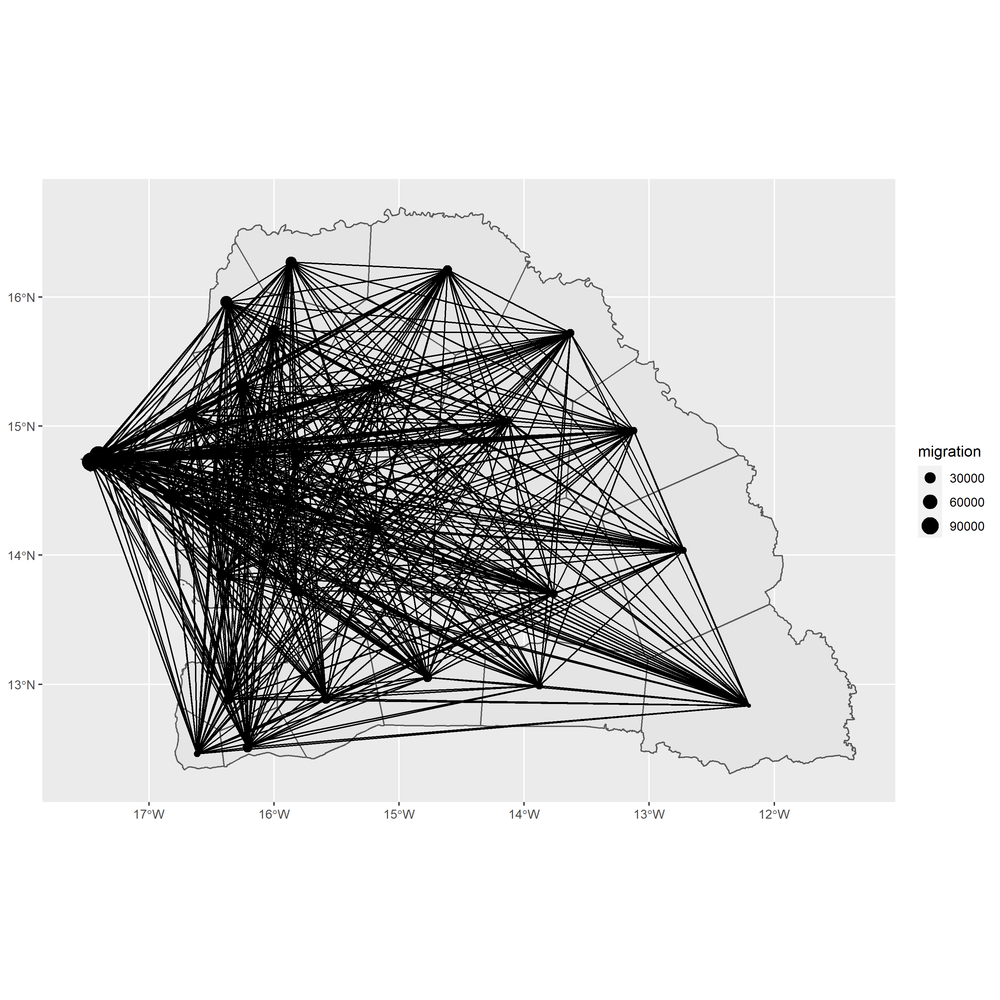
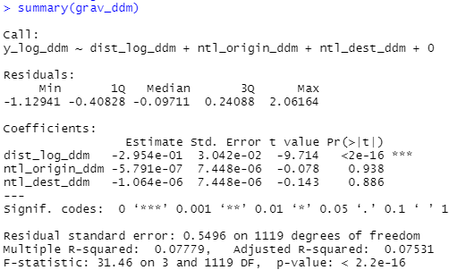
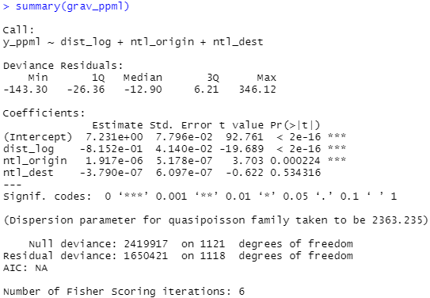
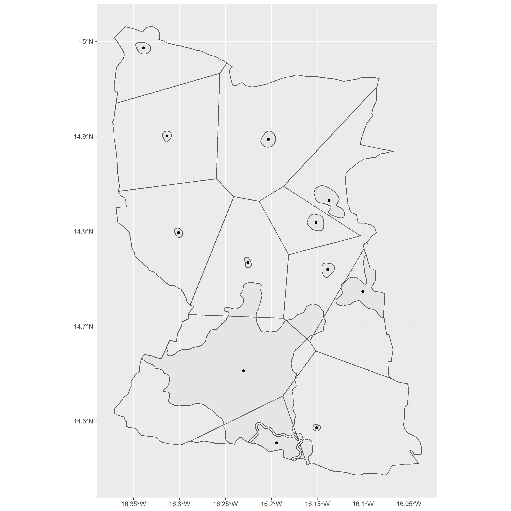

# Final Project

## Analysis of gravity model for London/Introduction

Following "Dr. D's Idiots Guide to Spatial Interaction Modelling for Dummies", in which we create a gravity model for London, helped me understand what was going on in this project before really getting into the weeds of it all. It provided a comprehensive overview of what our own approach should look like. The guide began with showing us how to calculate a distance matrix for all combinations of origin/destination pairs of boroughs. Next, the guide went over how to create estimates of commuter flows by transportation type for the whole country (this part also included extra data on income, job numbers, and total population for the areas, which shows the relative desirability of these areas). These commuter flows can be visualized with lines connecting each borough, with varying thickness - higher thickness represents higher commuting flows, and thinner lines represent lower commuting flows. After this, Dr. D's guide explained how to create the gravity model itself, providing some mathematic and descriptive elements about how the model works. It was incredibly helpful to see the formulas and their descriptions written out before actually implementing the model. Finally, the guide went over how to estimate model parameters, and test/improve the model accuracy.

In addition to this guide, we were provided with Garcia's paper entitled "Modeling Internal Migration Flows in Sub-Saharan Africa Using Census Microdata". In the paper, the gravity model is described to “use population sizes at each location and the distance between them as the push-pull factors. The model can be expanded by adding the previously identified characteristics of the locations that are related to migration, resulting in a series of gravity-type spatial interaction models.” These models seem to be able to help interpret migration patterns by giving us a degree of importance that location characteristics can have toward migration, as opposed to simply using population to do so. In a migration context, the gravity model especially helps because it looks at how to minimize the costs while simultaneously optimizing the benefits with geographic, sociodemographic, economic, climatic, and environmental factors playing a role. 

Given what was covered in Dr. D's Idiots Guide and Garcia's paper, I decided to go through the process of constructing my own gravity model and set of voronoi polygons for Senegal. 

However, my position was unique because I was one of the only people with multiple centerpoints of migration flow data inside of multiple ADM1's, as shown below:

Because I didn't have an accurate simple feature object that described the administrative subdivisions, I instead used the center points provided by worldpop and approximated those boundaries with voronoi polygons. So, with this in mind, it was clear to me that I was going to have to use the flow centerpoints (of which there were 34) instead of the ADM1 centerpoints (of which there were only 14) for my analysis and I ended up doing  this project using the voronoi polygons rather than the Senegalese administrative subdivisions. The voronoi polygons for the 34 centerpoints of migration flows in Senegal is plotted below:

And below are spatial plots that describe in/out migration by the voronoi polygons in Senegal:

## Origin-destination (OD) Matrix

The dataset I ended up with includes the origin point/polygon, destination point/polygon, the distance between the origin and destination points, migration flows from the origin to the destination, the nighttime lights of the origin polygon, and finally the nighttime lights of the destination polygon. The reason I included nighttime light data is because it can help us approximate how develoed an area is, similarly to how we used income or population in the london example. The dataset is as follows:

Then I created an origin-destination (OD) matrix for migration flows, which is shown below:

As you can see, there are 34 rows and 34 columns in our OD matrix. Each individual cell within the OD matrix represents a particular combination of the flow centerpoints (of which there were 34, as specified above). The row number represents the centerpoint that is the origin of the migration, and the column number represents the centerpoint that is the destination of the migration. So with that in mind, the number in each cell represents the predicted migration flow FROM the centerpoint on the row index TO the centerpoint at the column index. There are N/A values for the center diagonal, which symbolizes the number of people who migrated from that centerpoint to itself; we did not need to take these into account.

## How the OD matrix is used to model migration across the voronoi subdivisions of Senegal

As described above, my OD matrix is a 34x34 matrix. Each entry is representative of the migration flow from one centerpoint (the row index) to another (the column index). We also have information about distances between each pair of centerpoints.

The below plot shows how we are able to visualize our OD matrix; each centerpoint of migration is connected to all the others with lines.

It was at this point that I used my data to produce gravity models. The first type of gravity model I went with was a double demeaning model, which is also known as a DDM. The summary of the DDM is as follows, which can be used to test the goodness-of-fit of our DDM:

As you can see, our model had an R-squared of .07531, meaning our model accounts for around 7.531% of the variation of flows in the system. This is much lower than we would like. However, we observed a residual standard error of .5496, which is not too bad (the closer this is to zero, the better). Next, I used a poisson pseudo maximum likelihood model, which is also known as a PPML model. The summary of the PPML is as follows:

As you can see, this model seems to indicate that distance and nighttime lights of the origin are both statistically significant. However, the deviances are both really high, which is indicative of a poorly fit model.

Given that both of our models were poorly fitted,

## Animated migration

I then made an animated plot of migration, which shows the small points travelling between the centerpoints as the migration from one area to another.

If I were going to modify the number of points departing from each origin, I would look at the origin flows sums from the OD matrix and weigh the number of points departing from each origin accordingly. So for example, If the outmigration flows from origin one are substantially higher than origin two, I would have more points departing from origin one in the animation to represent higher migration flows than origin two. Likewise, if there origin three and origin 4 have virtually the same amount of outmigration flows, I would have the same number of points departing from these origins. I would modify the time variable by stretching it out more. The data has a difference of about 5 years, so each point travelling from an origin to a destination symbolizes a migration period of 5 years. So instead of showing these migrations in only 6 seconds, it could be nice to visualize it over a longer period of time. The gravity model would be able to update these attributes that would produce a closer-to-reality simulation because it takes into account many factors, such as nighttime lights, distance between points, and more. Including these factors in our simulation will inherently make it closer to reality because the more factors you include, the closer to reality it will be.

## Tesselation of voronoi polygons

Below is my Voronoi tesselation of my higher resolution administrative subdivision, which is Diourbel. I used the center points of each settlement to produce the tesselation.

In order to produce an OD matrix of these higher resolution entities, I would . The variables I would include are largely the same; however, I would certainly look into including other variables (like those in the DHS data we used in project 2) to see if including any additional variables would aid our model. For example, I think population data/population density levels, average education levels, and average salary for each polygon would provide valuable insight into our analysis at that higher level. Like I said previously, geographic, sociodemographic, economic, climatic, and environmental factors would all be good variables to consider. I would modify the number of points departing from each origin by . I would determine destinations by . When it comes to the time variable, I would make its scale . The gravity model would update these attributes to produce a different simulation of migration by . To integrate migration and transport activities at differing geospatial and temporal scales, I would .
