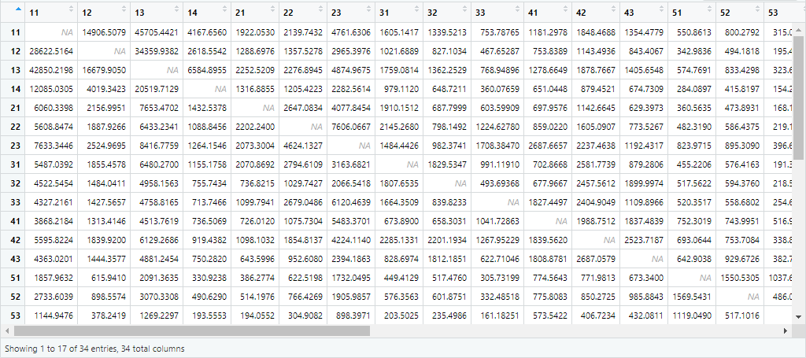

# Final Project

## Analysis of gravity model for London

Following "Dr. D's Idiots Guide to Spatial Interaction Modelling for Dummies", in which we create a gravity model for London, helped me understand what was going on in this project before really getting into the weeds of it all. It provided a comprehensive overview of what our own approach should look like, and it showed us how to calculate a distance matrix, how to use our flow data, and finally how to model the migration movements.

This is supplemented by Garcia's paper, in which the gravity model is described to “use population sizes at each location and the distance between them as the push-pull factors. The model can be expanded by adding the previously identified characteristics of the locations that are related to migration, resulting in a series of gravity-type spatial interaction models.” These models seem to be able to help interpret migration patterns by giving us a degree of importance that location characteristics can have toward migration, as opposed to simply using population to do so.

## Origin-destination (OD) Matrix

## How the OD matrix is used to model migration across the administrative subdivisions of Senegal

## Animated migration

## Tesselation of voronoi polygons

