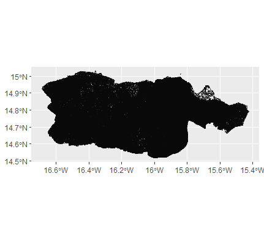

# Project 2

## Provide a written description of your selected household survey including the number of household and person observations as well as the variables in your source data.

For project 2, I began by requesting data for Senegal from DHS; the most recent year I could find was 2016. My proposal for this data can be found on my index . 
After the proposal was successful and I had access to the Senegal data, I imported the household survey dataset and looked at that data.

As you can see, there are a staggering amount of entries and columns in this dataset. To be more specific, there are 4,437 households accounted for in this dataset and 7,415 possible variables. To calculate the total number of persons, I took the sum of the size column; which gave me a total of 41,632 individuals. I identified the following variables as such:

Household ID : hhid

Unit : hv004

Survey weights : hv005

Number of household members : hv009/1000000

Location (this variable had both urban and rural, I combined these for each ADM1): hv022

Gender of household members : columns 468-533

Age of household members : columns 534-599

Highest education level attained : columns 600-665

Wealth : hv270

The gender, age, and education variables consisted of 66 columns. This is because the maximum household size was 66, so 66 columns were needed to accommodate this (one for each possible member of the households). I then pivoted my data based for each column separately and bound them together to give myself a dataframe of the values per each individual rather than households. After pivoting, we ended up with 41,632 individuals which is the same as the number of individuals specified above.

## Provide a written description of your spatially located households at the adm0 level of your selected location, including how you located each household, generated the household structure including demographic attributes of persons, and the percent error calculated.

To get my spatially located households at the adm0 level of Senegal, I began by calculating the average number of households of Senegal as the sum of the population raster for Senegal divided by the mean household size of the DHS data. To then generate the household structure including demgraphic attributes of persons, I used this number of households and randomly generated points from the population as households, using the population raster as the probability density and the Senegal shape file as the win. The x and y coordinates from these points are used with the same coordinate system of our adm0. Then I randomly sampled from these generated households using the slice_sample function; this selected random points from our household data with n being the average household number of households that we calculated above, with replacement on. The weighted error I ended with was 0.09159064%, which is exceptionally low and a good sign.

I also expanded the generated households to persons with adm0 locations. This was more computationally expensive, but in the end it still ran successfully. To do this, I pivoted the variables again (this took a bit longer than before) and bound them together. The weighted error after pivoting was 9.041172%, which was a lot higher than the other - this is not as ideal, but still decent.

## Provide a written description of your spatially located households at the adm1 or adm2 level of your selected location, again including how you located each household, generated the household structure including demographic attributes of persons, and the percent error calculated. Further analyze your synthetically generated households and persons with regard to percent error. Do you think this population is more or less accurate than the one generated at the adm0 level? What could you have done to improve your measures of accuracy?

To start this process, I began by subsetting the data by my intended adm1 (Diourbel). Next, I calculated the average number of households of Diourbel as the sum of the population raster for Diourbel divided by the mean household size of the DHS data (subsetted to Diourbel locations). To then generate the Diourbel household structure including demgraphic attributes of persons, I used this number of households and randomly generated points from the population as households, using the Diourbel population raster as the probability density and the Diourbel shape file as the win.

The first of the 2 plots below shows the overall Senegal household data (gold) vs the Diourbel data (green). The second plot shows the synthetically generated sample from all Senegal households (gold) vs the synthetically generated sample from Diourbel households (green). As you can see, these are relatively similarly shaped.

 

Then I randomly sampled from these generated households using the slice_sample function; this selected random points from our Diourbel household data with n being the average household number of households that we calculated, with replacement on. The weighted error I ended with was 0.1702096%, which was a very good error value. Given this weighted error, I think this population is less accurate than the one generated at the adm0 level; .17% is greater than .09%, meaning the generated population at the adm0 level is more accurate. However, the difference between these two values is very small, so they are pretty similar in the big picture.

I also expanded the generated households to persons in Diourbel. To do this, I pivoted the gender, age, and education variables again and bound them together. The weighted error of 8.822475%; thus the error of the persons level of Diourbel is better than the eorror of the persons level at the adm0 level. The plot below is a plot of our synthetically generated persons from Diourbel.

Next, I trained a multinomial logistic regression model using a 60-40 train-test split in order to predict education level. This resulted in an accuracy of around 62.8%, which was pretty good. After that, I used a random forest model which gave me an accuracy of 64.1%. Lastly, I trained a neural network (with keras) and got an accuracy of 69.4%. The confusion matrix for the neural network results is below.

It seems like the best way to make these models better would be to use more variables. Including more variables would logically improve the model's performance because doing so could capture currently unseen trends in the data.

## When compared to a randomly generated synthetic population that describes the demographic attributes of households and persons, does yours more closely approximate reality? How is yours an improvement over a synthetic population that was generated in accordance with complete spatial randomness? Generate plots and incorporate results from your work as evidence in support of an argument that the synthetic population you generated is a good approximation of the reality that existed in your selected location at that given time.

F
