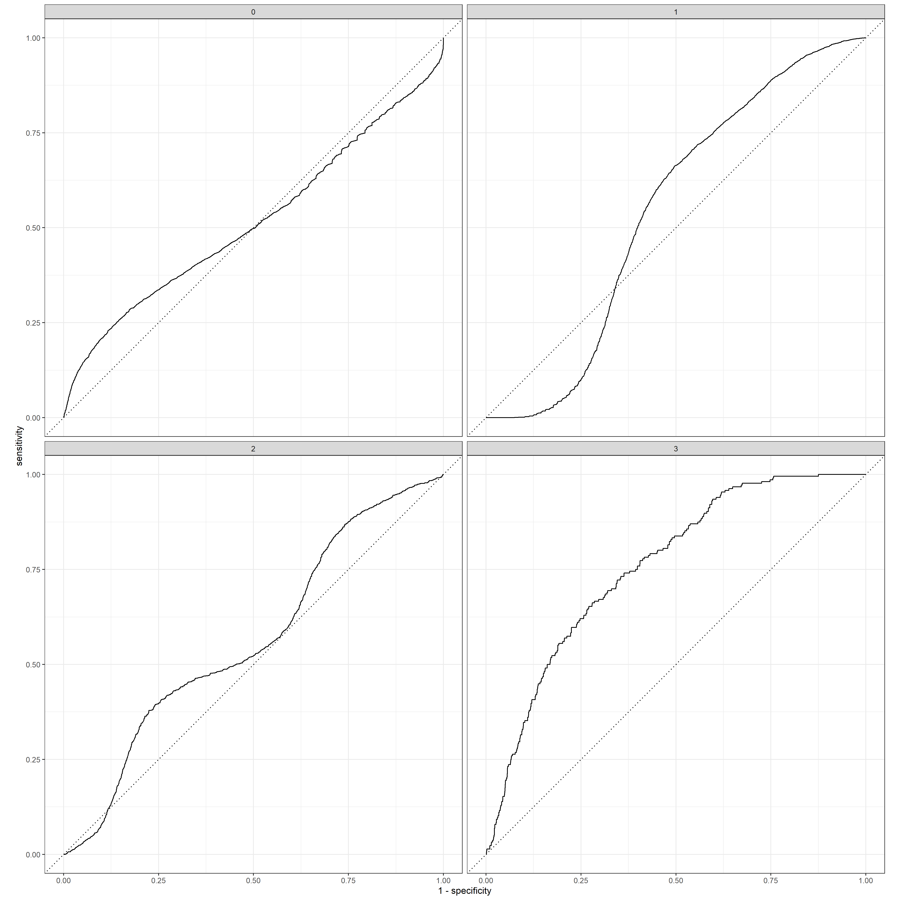

# Project 2

For project 2, I began by requesting data for Senegal from DHS; the most recent year I could find was 2016. My proposal for this data can be found on my index . 
After the proposal was successful and I had access to the Senegal data, I imported the household survey dataset and looked at that data.

As you can see, there are a staggering amount of entries and columns in this dataset. To be more specific, there are 4,437 households accounted for in this dataset and 7,415 possible variables. To calculate the total number of persons, I took the sum of the size column; which gave me a total of 41,632 individuals. I identified the following variables as such:

Household ID : hhid

Unit : hv004

Survey weights : hv005

Number of household members : hv009/1000000

Location (this variable had both urban and rural, I combined these for each ADM1): hv022

Gender of household members : columns 468-533

Age of household members : columns 534-599

Highest education level attained : columns 600-665

Wealth : hv270

The gender, age, and education variables consisted of 66 columns. This is because the maximum household size was 66, so 66 columns were needed to accommodate this (one for each possible member of the households). The sum of the weights equaled 4,437, which was the same as my household number. I then pivoted my data based for each column separately and bound them together to give myself a dataframe of the values per each individual rather than households. After pivoting, we ended up with 41,632 rows which is the same as the number of individuals specified above. However, the sum of the weights for these individuals was a few thousand different from the number of rows in the data. This is because when we changed from households to persons we changed the fundamental design of the survey, which introduces potential for error. This could have an adverse affect on our analysis. Additionally, the person-sample proportion was .002564785, meaning that our survey is only about .25% of the actual population of Senegal. While this is a pretty low proportion, we are still able to use this data to infer things about the greater population. 

To get my spatially located households at the adm0 level of Senegal, I began by calculating the average number of households of Senegal as the sum of the population raster for Senegal divided by the mean household size of the DHS data. To then generate the household structure including demographic attributes of persons, I used this number of households and randomly generated points from the population as households, using the population raster as the probability density and the Senegal shape file as the win. The x and y coordinates from these points are used with the same coordinate system of our adm0, which helped maintain our spatial accuracy. Then I randomly sampled from these generated households using the slice_sample function; this selected random points from our household data with n being the average household number of households that we calculated above, with replacement on. The weighted error I ended with was 0.09159064%, which is exceptionally low and a good sign.

I also expanded the generated households to persons with adm0 locations. This was more computationally expensive; I often got an error saying that there was not enough space left in my memory, but in the end it still ran successfully. To do this, I pivoted the variables again (this took a bit longer than before, but eventually worked) and bound them together. The weighted error after pivoting was 9.041172% which was not incredibly ideal, but still decent. Overall, doing all of this at the adm0 level was computationally taxing but (in comparison to the results in the next section) worth it, because it gave me valuable insight about whether it was better or worse to look at things in a more generalized or more specific context. 

To start the process of locating households at the adm1 level, I began by subsetting the data by my intended adm1 (Diourbel). Next, I calculated the average number of households of Diourbel as the sum of the population raster for Diourbel divided by the mean household size of the DHS data (subsetted to Diourbel). To then generate the Diourbel household structure including demgraphic attributes of persons, I used this number of households and randomly generated points from the population as households, using the Diourbel population raster as the probability density and the Diourbel shape file as the win. Something to note around here is that I could've requested a shapefile from the DHS survey data, which would've given us a radius for each household cluster; we would've known more specifically where the household was, which could've helped the spatial accuracy of our analysis. While using the x/y coordinates from the raster cells did still help our spatial accuracy, this shapefile could've been a helpful layer to have and it would be something to look into using for the future.

The below plots show the difference between drawing from all of Senegal versus just Diourbel. The number of households in Diourbel were 345, which is substantially less than all of Senegal.

 

These graphs show that it is more desireable to draw from the entire country rather than just a single adm1. This makes sense because using the larger overall surveyed country rather than one particular area allows for the overarching trends to be captured. Using just Diourbel would limit the trends that we are able to observe, which is not as helpful. 

Then I randomly sampled from these generated households using the slice_sample function; this selected random points from our Diourbel household data with n being the average household number of households that we calculated, with replacement on. The weighted error I ended with was 0.1702096%, which was a very good error value. Given this weighted error, I think this population is less accurate than the one generated at the adm0 level; .17% is greater than .09%, meaning the generated population at the adm0 level has less error, thus more accurate. This makes sense because the weights aren't as representative when you are subsetting from a country level survey; hence, going from adm0 to adm1 will introduce more error than before. 

I also expanded the generated households to persons in Diourbel. To do this, I pivoted the gender, age, and education variables again and bound them together. The weighted error of 8.822475%; thus the error of our individual data at the adm1 level is better than the eorror of the individual data at the adm0 level. This is surprising, because as was discussed above, the weights should not be as good because we are looking at an adm1 with country level data. However, in this case it seems that the error decreased on the individual level. 

To have further increased my accuracy in all of these cases, I could've used population raster data from 2016. I used population raster data from 2019 throughout this project, which was three years after the DHS survey data. This discrepancy could make the synthetic populations we generated at both the adm0 and adm1 levels appear slightly less accurate.

For the next step in my analysis, I generated heat maps (using the heatmaply library) for raw data, scaled data, normalized data, and percentage data, respectively. 

The raw data heatmap shows us the heterogeneity of the combinations of the variables that are going into the model; the only place where the model is really giving us different results from everywhere else was in the bottom left corner with age. The scaled data, which shows all the variables at the same scale and interval, had more corresponding values and we could see relative patterns emerging. The normalized data showed even more heterogeneity, which is representing the fact that our model is able to make more predictions along the continuum of all the different outcomes that we potentially have; this improves its predictive power. Lastly, the percentage data was the best of the preprocessing transformations; doing this analyzes the data to give us a better idea of how effective the data is, and it improves the predictive power of the logistic regression. Each one was progressively better than the prior.

Next, I trained a variety of ML models to predict education level. I began with a multinomial logistic regression model using a 60-40 train-test split in order to predict education level. This resulted in an accuracy of around 62.8%. The gains and ROC curves for the logistic regression model are below, respectively:
 

After that, I used a random forest model which gave me an accuracy of 64.1%. The gains and ROC curves for the ranger random forest model are below, respectively:
 

Looking at the gains and ROC curves for both the multinomial logistic regression model and the random forest model, it is clear to me that the random forest model is better. The curves for the random forest model are much closer to the optimal curves than the multinomial logistic regression model's curves.

Lastly, I trained a neural network (with keras) and got an accuracy of 69.4%. The confusion matrix for the neural network results is below.

While none of these models had an incredible accuracy, the validation process helped us confirm that they were not overfitting. I think that one way to increase the accuracy of these models in the future would be to use more variables, because that would help find more relationships that could make our predictions better.

Overall, my analysis seemed to show that the DHS survey data was a relatively good representation of the true population. As i stated above, the DHS survey was conducted in 2016, and my population raster data is from 2019; this difference in years may have had an impact on my results, which is something to consider. Despite the time gap between the 2 data sets, the below plots seem to show evidence that the synthetic population you generated is a good approximation of the reality that existed in Diourbel. The first plot is of the synthetic population we generated for Diourbel, and the second plot is the population raster for Diourbel.

When comparing and contrasting these plots, there are almost no differences between the synthetically generated persons and the actual population raster. The large clumps of people we had previously identified as de facto settlements in Diourbel (at the adm2 level) are clearly reflected in our synthetically generated plot. This shows us how our synthetically generated population is an improvement over a synthetic population that was generated in accordance with complete spatial randomness. A synthetic population with complete spatial randomness wouldnt've captured those settlements/trends in my selected area.
