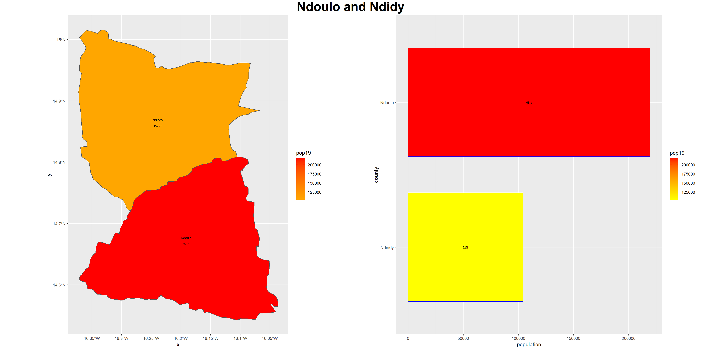

# Project 1

The lower-middle income country I chose for project 1 is Senegal. Senegal had ample data available for me to analyze, ranging from adminstrative subdivisions 1-4 (Which I will denote throught the project as ADM1-4). The geospatial representation of Senegal and the barplot for the population distribution of Senegal is shown side by side, below.

From both plots, it is apparent that the ADM1 Dakar is the most highly/densely populated area. This makes sense, because Dakar is the country's capital - usually the capital of a country is highly populated. Additionally, it is the most western point of the African mainland and it "has historically served as the gateway to West Africa", which makes it a vital location and a cultural epicenter for all of Africa.[^fn1] ADM1s close to Dakar also have a relatively higher population than some of the other administrative areas, which is logical because it is more desireable to be close to the capital. The least populous/dense area of Senegal is the ADM1 of Kedougou, which is the furthest area away from Dakar. Its population is a mere 178,464 people. 

The population density of Dakar and ADM1s close to it, particularly Thies and Diourbel, are substantially higher than most of the other areas. Dakar in particular has a very high density of about 6,479 people per kilometer squared. Meanwhile, Kedougou has a population density of about only 10 people per kilometer squared. Overall, it was very helpful to see the distribution of population across Senegal's ADM1s with the map and bar plot next to each other - it gave me a better idea of how Senegal is broken up and where people tend to live.

I then looked at the population levels of the ADM2s within each ADM1 with a second barplot. The ADM1 bars were sized accordingly to the ADM1 population levels. These bars were then internally broken up in the inside by the ADM2 population levels. This made it extremely easy to see both the ADM1 and ADM2 populations within the context of all of Senegal.

Most of the ADM1s contain 3 or less ADM2s. Some ADM2s (particularly in Dakar and Thies) have substanstially higher populations than even some ADM1s, which makes sense.

The subdivisions of Senegal that I chose to be the base for my agent-based model of de facto settlements are Ndidy and Ndoulo, which are ADM3's that make up the entirety of the ADM2 Diourbel, which is inside of the ADM1 Diourbel. Ndoulo had a population of 219,298 people in 2019, while Ndidy had a population of 104,096 people. I chose to model these two areas because Diourbel's proximity to Dakar meant that there would be a decent amount of people to model, but at the same time it wouldn't be too urban of an area to model. The initial plot of Ndoulo and Ndidy showed me that Ndoulo has a large population in its south central area, but there are a few smaller towns and settlements scattered around the outskirts. Ndidy was entirely sparsely populated, and the settlements seemed like they were sporadically scattered around. Thus, I figured this would be a good area to model and try to capture the smaller settlements in the north, as well as the larger city. I also figured that roads, health care facilities, and other features would help explain my models and possibly connect these settlements in the north with the larger ones down south. The plot below shows the spread of population in Ndoulo and Ndidy (the southern half of the division is Ndoulo).

The population distribution for Ndoulo and Ndidy by ADM4, shown via map/geometric bar plot, is as follows:

 

As you can see, the population is greatest in the ADM4 Patar. However, like the other plot showed, Patar's population was mostly concentrated in the southwestern portion of the area, which could be a little misleading. Most of the other ADM4's of Ndoulo have a relatively smaller population than Patar but still generally more than those ADM4's in Ndidy. However, Ndidy has enough population to the point that we should be able to identify some smaller settlements.

Given all of this information, I decided to model the de facto settlements for Ndoulo and Ndidy. I began this process by cropping and masking Senegal's population data, and I continued on by plotting the subdivision density with a sigma of .003051192. This gave me the following plot:

Next, to plot the contour lines surrounding settlements, I: converted the density plot to a spatial grid class, converted that to an image, and then created a contour object for which I used 3.5 million levels. This contour object can then be overlayed with the above plot to show the areas determined to have settlements in Ndoulo and Ndidy, which is shown below.

The contour lines show that the densely populated area near southwestern Patar and some of the smaller surrounding areas were determined to be settlements. Additionally, there were a bunch of settlements identified in Ndidy, mostly in the eastern and the northern areas. However, we can take this visualization a step further by truly isolating the contoured areas from the rest of the non-populated areas. The resulting plot is pictured below, providing us with the countoured areas in blue. Each contoured area has a point inside of it; the size and color of this point is contingent on how populated the area is and how densely populated the area is, respectively. For example, the larger city in the middle of Ndoulo is both highly populated and densely populated so it is a large bright red point, whereas the smaller northern settlements are smaller closer-to-yellow points, signifying a lower/less dense population.

Zipf's Law states that the largest settlement is the basis for which we should expect each subsequent settlement's size to be. The largest settlement's population is just that settlement's population divided by one; the second largest settlement's population is expected to be the largest settlement's population divided by 2; this trend is expected to contiune such that the nth settlement's expected population can be calculated as the largest settlement's population divided by n. When I plotted Zipf's law for my area without taking the log of my variables, I got something very far from what I expected. This is because the largest settlement was substantially higher than all the rest.

 

I then took the log of both the rank and the population, which is much closer to what was expected. The below plots show the log(rank) and log(pop) plotted against each other for all of the polygons, and then the combined polygons. The combined polygon plot looks exactly as Zipf's law expected, whereas the plot for all polygons was closer than before (without the log) but still a little off.

 

To add another element into this analysis, we can plot roadways ontop of this plot. To do this, I downloaded the roadways dataset from HDX and unioned them with Ndoulo and Ndidy. I only included primary, secondary, and tertiary roads (purple, cyan, and blue, respectively) on my plot - had I included anything further, this plot could've gotten messy. 

Lastly, I plotted any major health care facilities, of which there was only one, at the center of the densely populated area.

In the final plot from above, the contour polygons from the initial contour plot were maintained and now have the points inside to give an indication of both population size and density. The countour polygon for the main city in the southwest is by far the largest, showing that the extent of the city or town is relatively expansive. Just northeast from there is the second largest polygon, but that one is still only a fraction of the size of the largest one. Additionally, the largest 2 polygons also have a higher population density than the rest (500 or more). The rest of the polygons are substantially smaller, with varying densities (all smaller than the other 2). So, the one primary settlement in the southwestern portion of the area serves as the centerpoint for the system. The fact that the only major health care facility in the area is in this settlement raises the number of people that may go to it. 

When it comes to the system of settlements sizes and relative location to one another,

When it comes to the transportation network and its capacity to facilitate access across my selected area, the primary (purple) roads link the second and third largest settlements to each other. Additionally, one primary road goes out of the western border which probably connects my area with another major settlement. This would be something to consider in the future - incorporating even more areas to expand the reach of this network. However, in my opinion the most important roads are the tertiary roads. The tertiary roads connect every settlement in Ndidy to each other in some way. The tertiary roads also link to the 2 largest settlements in Ndoulo. Without these roads, the network would be almost completely unconnected and the nodes would be relatively insignificant.

[^fn1] Source: https://eros.usgs.gov/westafrica/country/republic-senegal
