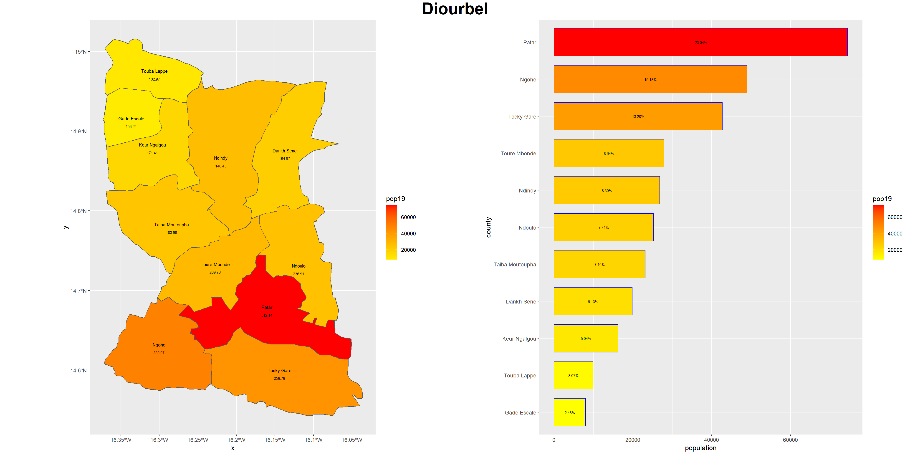

# Project 1

The lower-middle income country I chose for project 1 is Senegal. The geospatial representation of Senegal and the barplot for the population distribution of Senegal is shown side by side, below.

From both plots, it is apparent that Dakar is a very highly/densely populated area. This makes sense, because Dakar is the country's capital - usually, the capital of a country is highly populated. Additionally, it is the most western point of the African mainland, and it "has historically served as the gateway to West Africa", which makes it a vital location.[^fn1] Areas close to Dakar also have a relatively higher population than some of the other administrative areas, which is also logical because it is more desireable to be close to the capital. The least populous/dense area of Senegal is the adminstrative area of Kedougou, which is the furthest area away from Dakar. Its population is a mere 178,464 people. The population density of Dakar and areas close to it, particularly Thies and Diourbel, are substantially highere than most of the other areas. Dakar in particular has a very high density of about 6479 people per kilometer squared. Meanwhile, Kedougou has a population density of about only 10 people per kilometer squared (despite its area being over sixteen thousand square kilometers larger than Dakar's area).

We then looked at the second adminstrative level, and broke the population up into each second administration level inside of the first administration level.

The following 3D plot of Senegal shows the population around different adminstrations in 3D form.

The subdivision of Senegal that I chose to be the base for my agent-based model is Diourbel (at the adm 2 level, not adm 1), which had a population of 323,394 people in 2019. The following plot shows the spread of population in Diourbel, with ADM 2 only, then ADM 2 and 3, and finally ADM's 2, 3, and 4.

A color-coded barplot of the ADM4's of Diourbel is shown below:

And here is a map of the ADM2 Diourbel, broken up by ADM4. As you can see, the southern ADM4's have a higher population than the northern ones.

[^fn1] Source: https://eros.usgs.gov/westafrica/country/republic-senegal
