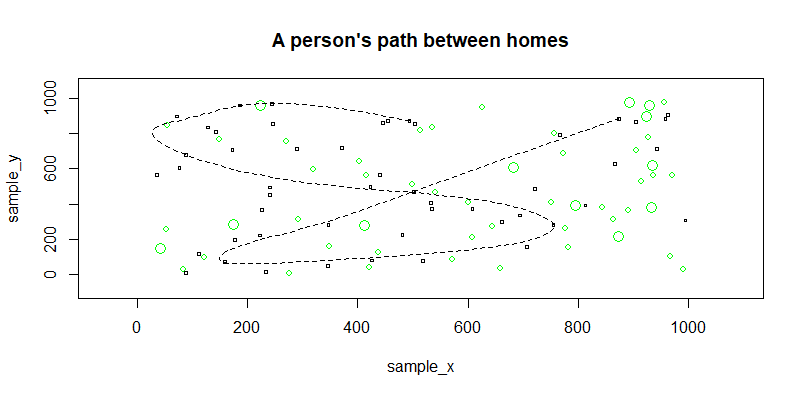

# DATA 440

## Getting Started With R and RStudio: Challenge Question
The plot below (with dimensions of 1000 x 1000) displays 50 squares, or 'dwelling units', randomly placed around. There are also 40 *small* circles, or small trees, scattered around the plot. Lastly, there are 12 *large* circles, or trees, randomly scattered as well. Seven of the fifty dwelling units were chosen at random. A path was then created and plotted that portrayed the path a person can take from house to house.

