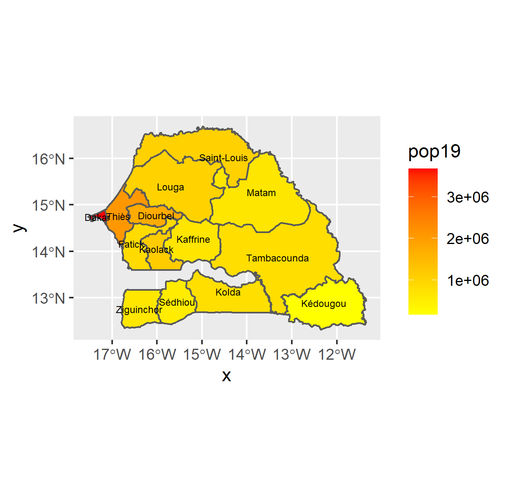

# Spatial Population Description (Continued)

This exercise had to do with rasters and population of our LMIC (for which I chose Senegal). We began by reading the raster data (100m resolution) in, which we obtained from the WorldPop site, using the raster command. Then, we read in the Administrative subdivisions for Senegal using read_sf (like before). Finally, we plotted both of these to give us the following plot:

 
 
As you can see, there were slightly higher concentrations of population in the western subdivisions of Senegal, with the middle/eastern subdivisions relatively blank.

Then, I extracted the raster based on the subdivisions. Even usuing 11 i7 cores, this took several minutes - seen as though there were 39 million gridcells, this makes sense. This created a dataframe called pop_vals_adm1, which had 23,760,362 observations. After calculating the population for each subdivision and summing all of them, we find that the sum of the population of Senegal in 2019 was 15,910,294. This seems about right, because google says that the population of Senegal in 2019 was around 16 million.

Creating a heatmap of population in Senegal was accomplished via the following code, and yielded the following map:
```
sen_sf_adm1 <- sen_sf_adm1 %>%
  add_column(pop19 = totals_adm1$pop19)

ggplot(sen_sf_adm1) +
  geom_sf(aes(fill = pop19)) +
  geom_sf_text(aes(label = NAME_1),
               color = "black",
               size = 2) +
  scale_fill_gradient(low = "yellow", high = "red")
  ```
   
   
  As you can see, the more densely populated areas are (generally) on the western side of Senegal.
