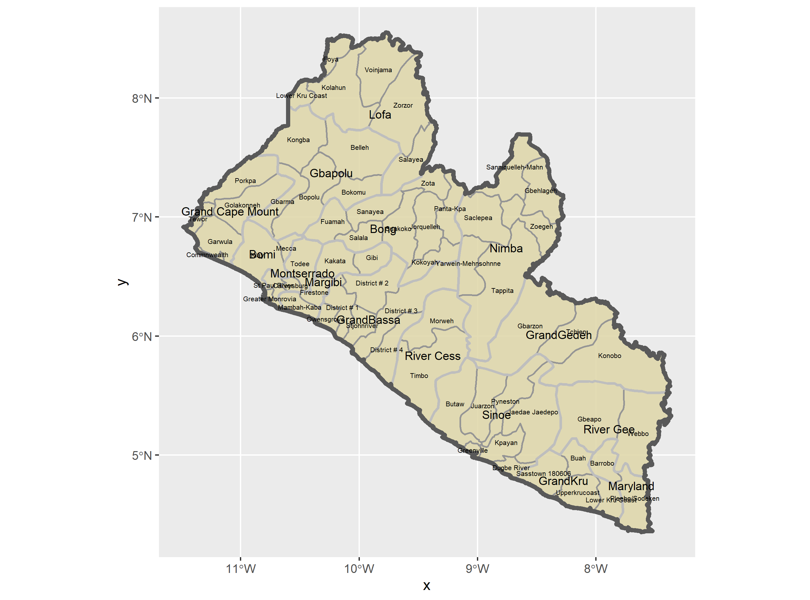

# Spatial Population Description: Liberia

This exercise had to do with using packages in R to plot spatial data. We created the below plot of Liberia, its counties, and its administrative subdivisions. We were able to acommplish this through the following code:
```
lbr_int  <- read_sf("gadm36_LBR_shp/gadm36_LBR_0.shp")
lbr_adm1  <- read_sf("gadm36_LBR_shp/gadm36_LBR_1.shp")
lbr_adm2  <- read_sf("gadm36_LBR_shp/gadm36_LBR_2.shp")
ggplot() +
  geom_sf(data = lbr_adm2,
          size = .65,
          color = "black",
          fill = "gold3",
          alpha = .65) +
  geom_sf(data = lbr_adm1,
          size = 1,
          color = "gray",
          alpha = .65) +
  geom_sf(data = lbr_int,
          size = 1.5,
          alpha = 0)  +
  geom_sf_text(data = lbr_adm2,
               aes(label = NAME_2),
               size = 1.75) +
  geom_sf_text(data = lbr_adm1,
               aes(label = NAME_1),
               size = 3)
  ```
 
 
Each respective boundary size is lower, so that it is easier to make out the more general boundaries. Additionally, I used black and gray to contrast each other so the boundaries popped. The text for administrative subdivisions can be hard to make out due to how many different subdivisions there are, combined with a lack of space for text.
